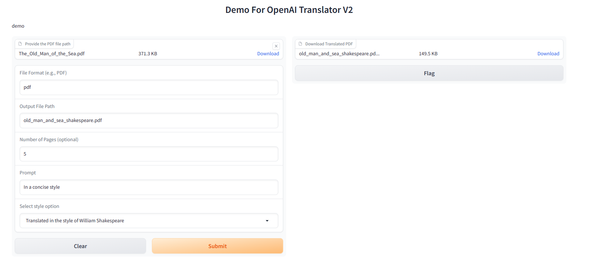
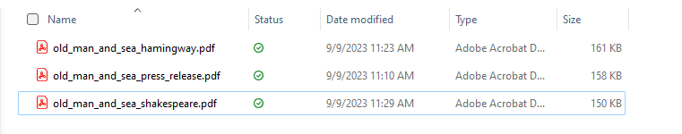

# 作业1：在 openai-translator gradio 图形化界面基础上，支持风格化翻译，如：小说、新闻稿、作家风格等

## 增加了gradio 图形化界面，支持上传文件和生成可以下载的文件。

## 支持用户输入的 prompt和风格化翻译：新闻稿，莎士比亚，海明威等不同的作家风格。

## 作业1的Pull Requests: https://github.com/DjangoPeng/openai-quickstart/pull/62/files

