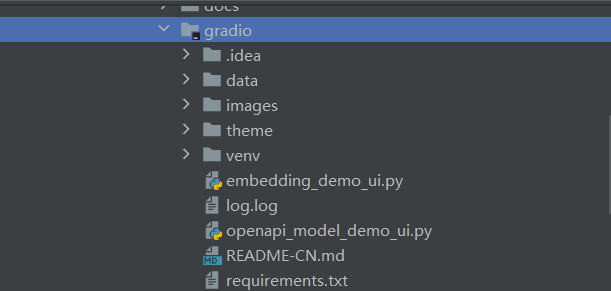
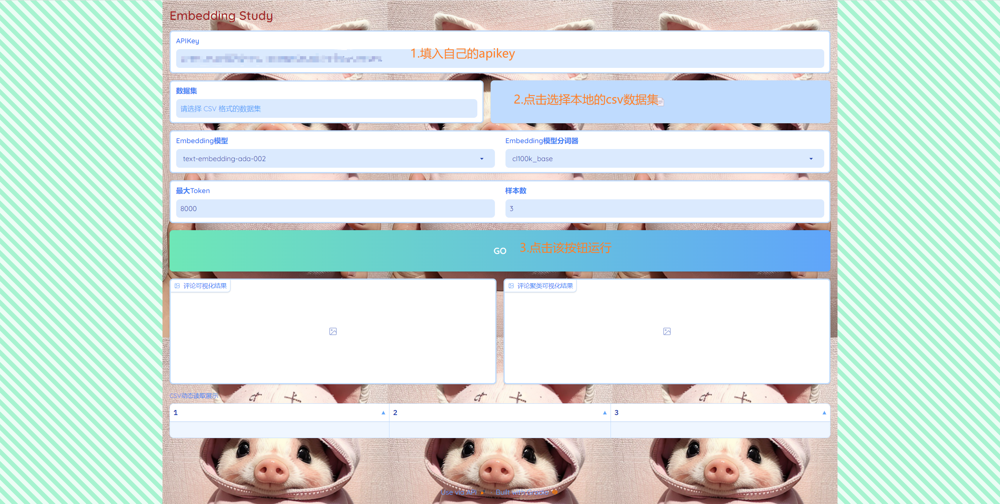
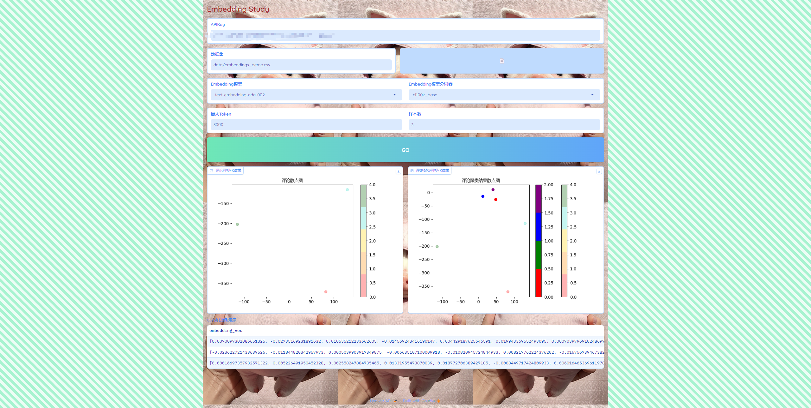
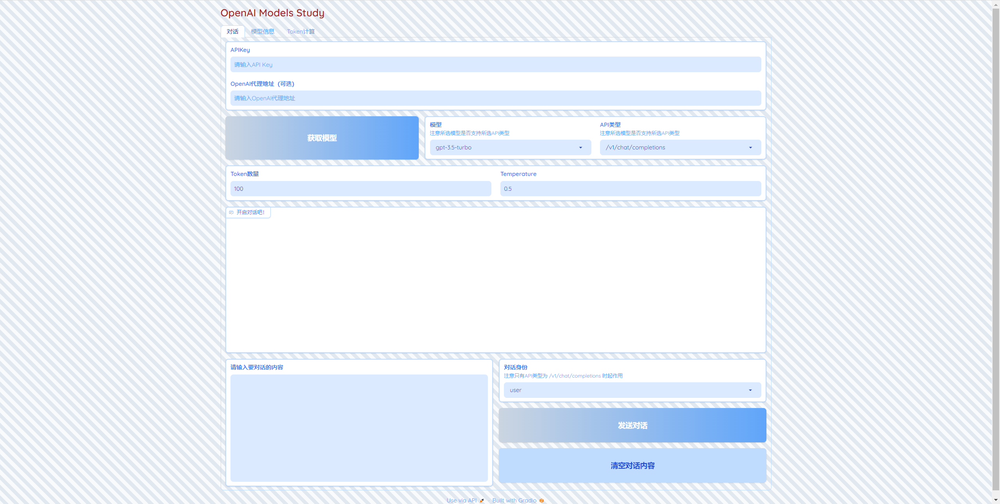
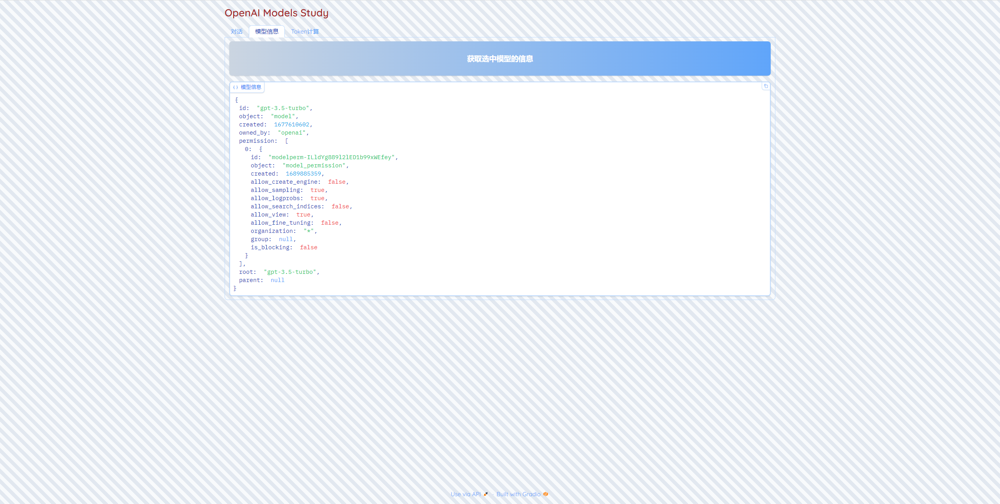
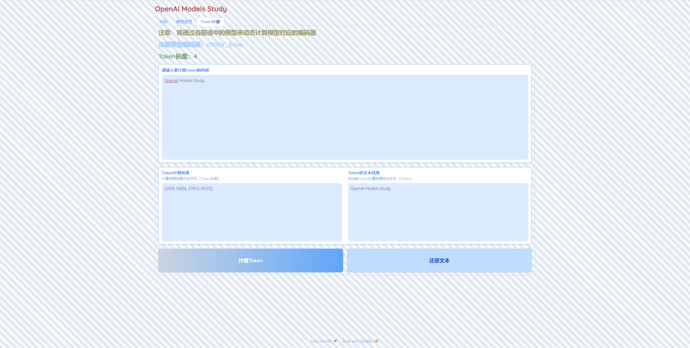

# 笔者环境

* Windows 11
* Python 3.10.6
* PyCharm 2023.1.2

# Python环境

**建议使用python虚拟环境，避免和其他项目的python库版本冲突**

```cmd
# 在当前项目下新建python虚拟环境
cd openai-quickstart\gradio>
openai-quickstart\gradio>python -m venv venv

# 进入python虚拟环境
openai-quickstart\gradio>.\venv\Scripts\activate

# 安装依赖库
(venv) openai-quickstart\gradio>pip install -r requirements.txt
```

# 注意事项

**如果要使用编辑器（如PyCharm）打开运行（或二次开发）项目，请选择`gradio`作为根目录，否则编辑器无法识别以上安装的python虚拟环境**



# Embedding模型GUI

`gradio\embedding_demo_ui.py`

运行项目

```cmd
# 进入python虚拟环境
cd openai-quickstart\gradio>
openai-quickstart\gradio>.\venv\Scripts\activate

# 运行项目，浏览器输入控制台打印的链接地址即可访问项目
(venv) openai-quickstart\gradio>python embedding_demo_ui.py
Running on local URL:  http://127.0.0.1:7860
```

## 效果





# OpenAI其他模型GUI

`gradio\openapi_model_demo_ui.py`

运行项目

```cmd
# 进入python虚拟环境
cd openai-quickstart\gradio>
openai-quickstart\gradio>.\venv\Scripts\activate

# 运行项目，浏览器输入控制台打印的链接地址即可访问项目
(venv) openai-quickstart\gradio>python openapi_model_demo_ui.py
Running on local URL:  http://127.0.0.1:7860
```

## 效果






