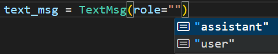

Python运行时并不强制标注函数和变量类型。类型标注可被用于第三方工具，比如类型检查器、集成开发环境、静态检查器等。
Python的`typing`模块和`typing_extensions`模块为类型标注提供了支持，阅读文档<https://docs.python.org/zh-cn/3.8/library/typing.html>可了解`typing`模块的用法。

本项目首先实现`data_types.py`，完成相关数据类型的定义。`data_types.py`的功能比较简单，无需赘述。下面主要介绍`data_types.py`采用的部分类型标注技巧。
1. [`TypedDict`](https://docs.python.org/zh-cn/3.8/library/typing.html#typing.TypedDict)

    `TypedDict`能定义带类型标注的字典类型。在编写代码时，IDE能提示该字典包含的字段及其类型。下图的示例中，VSCode提示了TextMsg包含`role`字段。由于`role`字段是Literal["user", "assistant"]类型，VSCode展示了它的2个可选值。

        
    在运行时，类型信息会被忽略，`TypedDict`创建的字典和普通字典完全相同，尝试执行

        ```bash
        python data_types.py
        ```

    可以观察到输出结果

        ```Plain Text
        <class 'dict'>
        {'role': 'user', 'content': '42'}
        ```
2. [TYPE_CHECKING](https://docs.python.org/zh-cn/3.8/library/typing.html#typing.TYPE_CHECKING) & [ForwardRef](https://docs.python.org/zh-cn/3.8/library/typing.html#typing.ForwardRef)

    `typing.TYPE_CHECKING`是被第三方静态类型检查器假定为 True 的特殊常量。但在运行时的值为False。
    `ImageMsg`的`image`字段展示`ForwardRef`的用法。IDE能正确地提示`image`字段的类型，但在运行时，由于`TYPE_CHECKING`为False，`streamlit.elements.image`不会被导入，避免`data_types`依赖`streamlit`模块。


作业1：除了`typing.TypedDict`之外，也有其他的库用类型标注的方式完成数据类型定义。请了解`dataclasses`和`pydantic`的用法，尝试用`dataclasses.dataclass`或`pydantic.BaseModel`实现`TextMsg`。思考这三种方式各自有何优缺点。
