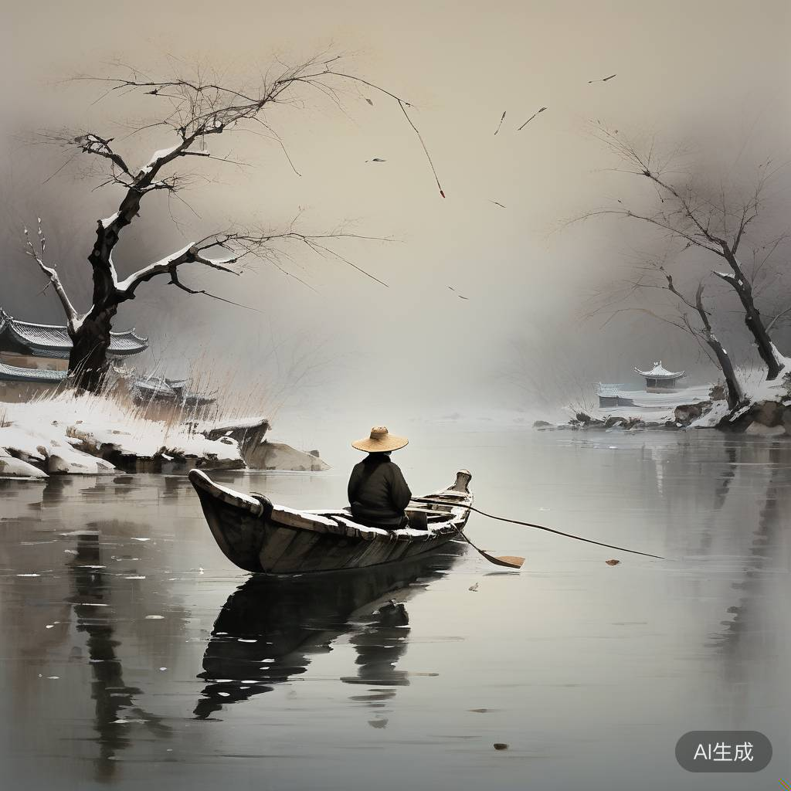

`api.py`实现了调用CogView和CharacterGLM的代码，包括
1. `generate_cogview_image`：用`zhipuai`库（官方sdk）调用CogView，返回图片url，可通过浏览器打开url查看图片，也可以用requests下载图片。参考<https://open.bigmodel.cn/dev/api#cogview>
2. `get_characterglm_response`：用`requests`库调用CharacterGLM，获得流式响应，参考<https://open.bigmodel.cn/dev/api#characterglm>

这两个API都需要智谱开放平台API key，参考 <https://open.bigmodel.cn/usercenter/apikeys> 


`cogview_example.py`展示了一个CogView的示例，执行该脚本，输出如下：
```Plain Text
image_prompt:
国画，孤舟蓑笠翁，独钓寒江雪
image_url:
https://sfile.chatglm.cn/testpath/af9a2333-1b8e-58e7-9d9f-9ac52934935c_0.png
```

浏览器打开url，可以查看生成的图片。注意：每次执行该脚本，都会生成新的图片，您的生成结果可能与示例结果不同。




`characterglm_example.py`展示了一个CharacterGLM的示例，执行该脚本，输出如下：
```Plain Text
（
眼神
变得
暗
淡
）
真的
吗
？
可是
我
总
觉得自己
撑
不了
多久
了
```
注意：每次执行该脚本，都会生成新的图片，您的生成结果可能与示例结果不同。


作业2-1：为了提高并发数，许多python程序会采用异步方式（async/await）调用API，请尝试实现异步的CharacterGLM API。提示：可以用aiohttp或httpx等异步请求库代替`get_characterglm_response`采用的requests库。

作业2-2：尝试修改文生图的prompt，生成不同风格的图片，例如，油画、水墨画、动漫等风格。
