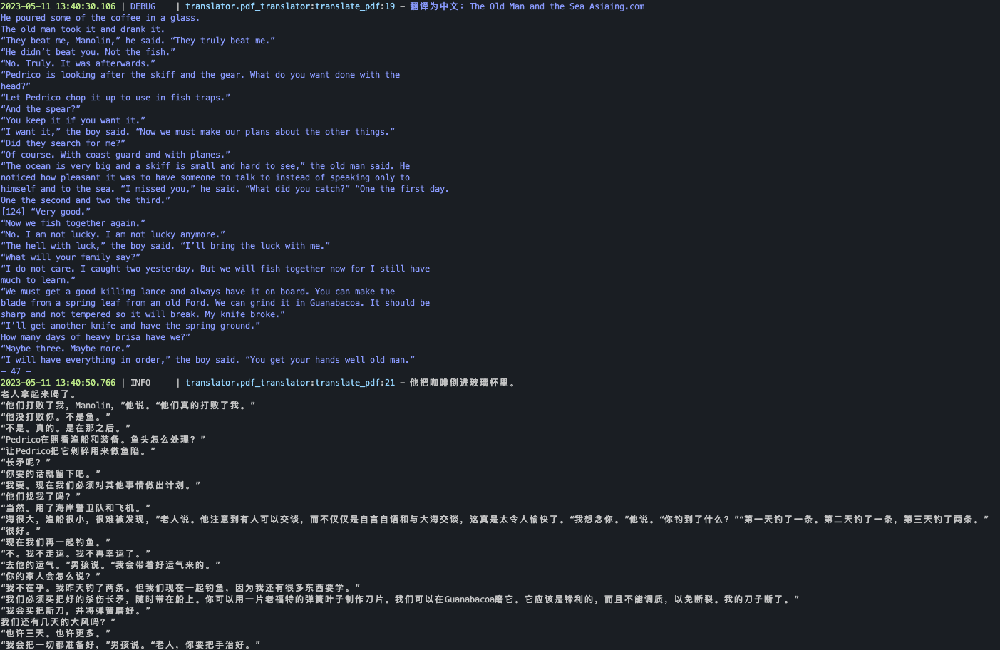

# OpenAI-Translator

<p align="center">
    <br> <a href="README.md"> English </a> | 中文
</p>
<p align="center">
    <em>所有的代码和文档完全由 OpenAI 的 GPT-4 模型生成</em>
</p>

## 介绍

OpenAI 翻译器是一个使用 AI 技术将英文 PDF 书籍翻译成中文的工具。这个工具使用了大型语言模型 (LLMs)，如 ChatGLM 和 OpenAI 的 GPT-3 以及 GPT-3.5 Turbo 来进行翻译。它是用 Python 构建的，并且具有灵活、模块化和面向对象的设计。

## 为什么做这个项目

在现今的环境中，缺乏非商业而且有效的 PDF 翻译工具。很多用户有包含敏感数据的 PDF 文件，他们更倾向于不将其上传到公共商业服务网站，以保护隐私。这个项目就是为了解决这个问题，为需要翻译他们的 PDF 文件同时又要保护数据隐私的用户提供解决方案。

## 示例结果

OpenAI 翻译器目前还处于早期开发阶段，我正在积极地添加更多功能和改进其性能。我们非常欢迎任何反馈或贡献！


<p align="center">
    <em>"老人与海"</em>
</p>

## 特性

- [X] 使用大型语言模型 (LLMs) 将英文 PDF 书籍翻译成中文。
- [X] 支持 ChatGLM 和 OpenAI 模型。
- [X] 通过 YAML 文件或命令行参数灵活配置。
- [X] 对健壮的翻译操作进行超时和错误处理。
- [X] 模块化和面向对象的设计，易于定制和扩展。
- [ ] 实现图形用户界面 (GUI) 以便更易于使用。
- [ ] 添加对多个 PDF 文件的批处理支持。
- [ ] 创建一个网络服务或 API，以便在网络应用中使用。
- [ ] 添加对其他语言和翻译方向的支持。
- [ ] 添加对保留源 PDF 的原始布局和格式的支持。
- [ ] 通过使用自定义训练的翻译模型来提高翻译质量。


## 开始使用

### 环境准备

1. 克隆仓库代码
```bash
git clone git@github.com:DjangoPeng/openai-translator.git
```

2. 准备python环境.
- 版本要求 **python > 3.10.13**
  - 无独立环境请移步 [miniconda安装管理python](../docs/FAQ/miniconda%E5%AE%89%E8%A3%85python.md)
- 安装依赖(确保你已经使用miniConda创建了python环境myenv, 并且激活了myenv环境)
```bash
pip install -r requirements.txt
```

3. 启动翻译程序

下列启动方式多选一即可
- 命令行方式启动(推荐), 使用OpenAI模型
```bash
# 把您的 OPENAI_API_KEY 替换为你具体的API_KEY
export OPENAI_API_KEY="sk-xxx"
python ai_translator/main.py --model_type OpenAIModel --openai_api_key $OPENAI_API_KEY --file_format markdown --book tests/test.pdf --openai_model gpt-3.5-turbo
```
即可看到结果


- yaml配置文件方式启动, 使用OpenAI模型
根据您的设置调整 `config.yaml` 文件：
```yaml
OpenAIModel:
  model: "gpt-3.5-turbo"
  api_key: "sk-xxx"

GLMModel:
  model_url: "your_chatglm_model_url"
  timeout: 300

common:
  book: "test/test.pdf"
  file_format: "markdown"
```
执行命令
```bash
python ai_translator/main.py --config config.yaml --model_type OpenAIModel
```

- 命令行方式启动, 使用GLM模型
```bash
export GLM_MODEL_URL="http://xxx:xx"
python ai_translator/main.py --model_type GLMModel --glm_model_url $GLM_MODEL_URL --book tests/test.pdf 
```

## 许可证

该项目采用 GPL-3.0 许可证。有关详细信息，请查看 [LICENSE](LICENSE) 文件。


