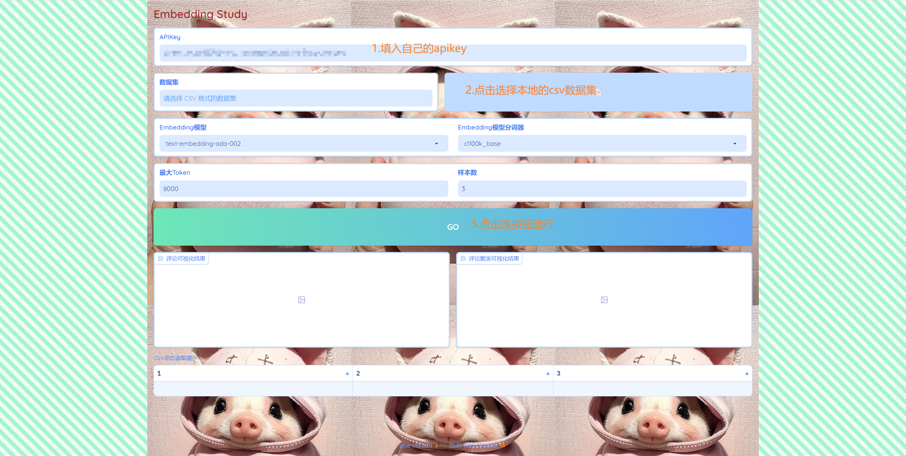
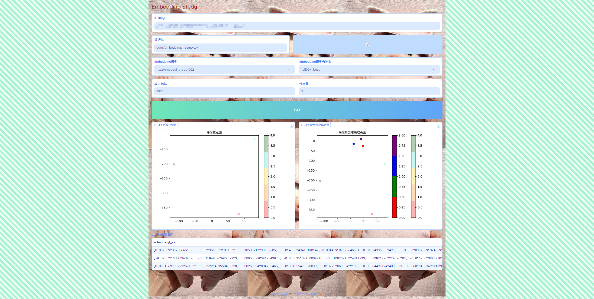
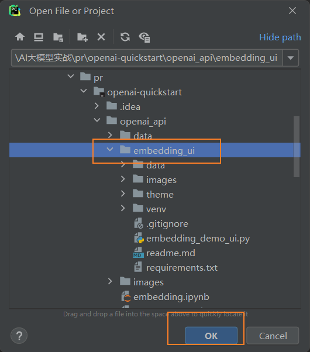

# 笔者环境说明
Windows11
Python版本：3.10.6
IDE：PyCharm
# 运行
## python虚拟环境创建
**前提：系统安装了python，虚拟环境的创建是根据当前系统安装的python版本来进行创建的**
**建议使用python虚拟环境，避免和其他项目的python库版本冲突**
**APIKEY：运行前编辑 embedding_demo_ui.py，在开头部分更改自己的APIKEY，openai.api_key = ''**

```cmd
# 在当前项目下新建python虚拟环境
cd \openai-quickstart\openai_api\embedding_ui
\openai-quickstart\openai_api\embedding_ui>python -m venv venv
# 进入python虚拟环境
(venv)\openai-quickstart\openai_api\embedding_ui>.\venv\Scripts\activate
# 安装依赖库
(venv)\openai-quickstart\openai_api\embedding_ui>pip install -r requirements.txt
# 运行项目，浏览器输入以下打印的链接地址即可访问项目
(venv)\openai-quickstart\openai_api\embedding_ui>python embedding_demo_ui.py
Running on local URL:  http://127.0.0.1:7863

To create a public link, set `share=True` in `launch()`.
```

# 效果



运行结果



# 注意事项

如果要使用编辑器打开项目，请选择`embedding_ui`作为根目录，否则编辑器无法识别以上安装的python虚拟环境


