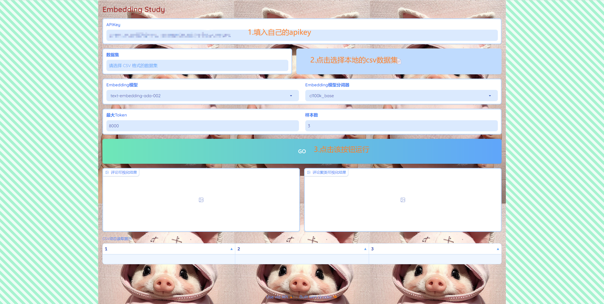

# python环境

**建议使用python虚拟环境，避免和其他项目的python库版本冲突**

```cmd
# 在当前项目下新建python虚拟环境
D:\AI\study\AI大模型实战\pr\openai-quickstart\openai_api\embedding_ui>python -m venv venv
# 进入python虚拟环境
(venv) D:\AI\study\AI大模型实战\pr\openai-quickstart\openai_api\embedding_ui>.\venv\Scripts\activate
# 安装依赖库
(venv) D:\AI\study\AI大模型实战\pr\openai-quickstart\openai_api\embedding_ui>pip install -r requirements.txt
# 运行项目，浏览器输入以下打印的链接地址即可访问项目
(venv) D:\AI\study\AI大模型实战\pr\openai-quickstart\openai_api\embedding_ui>python embedding_demo_ui.py
Running on local URL:  http://127.0.0.1:7863

To create a public link, set `share=True` in `launch()`.
```

# 效果



运行结果


# 注意事项

如果要使用编辑器打开项目，请选择`embedding_ui`作为根目录，否则编辑器无法识别以上安装的python虚拟环境

